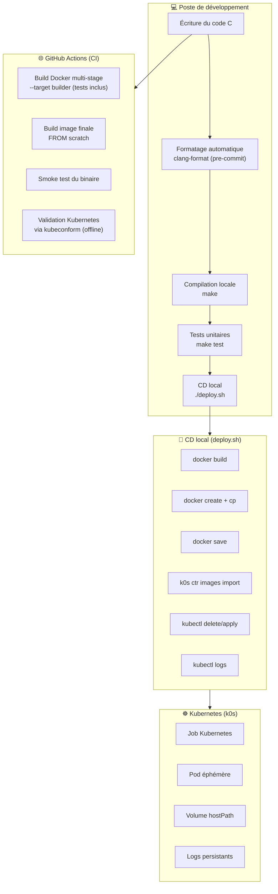

# 📘 Projet pédagogique : Batch C + Docker multi‑stage + Kubernetes (k0s)  
_Un parcours complet pour apprendre le C, Docker, Kubernetes et un pipeline CI/CD local_


Ce projet est conçu comme un **parcours d’apprentissage complet**, destiné aux débutants qui veulent comprendre comment passer :

➡️ d’un **programme C simple**,  
➡️ à une **image Docker propre**,  
➡️ à un **déploiement automatisé dans Kubernetes**,  
➡️ avec une **CI GitHub** et un **CD local**.

L’objectif est d’apprendre **toute la chaîne**, du code source jusqu’à l’exécution dans un cluster Kubernetes local (k0s), en gardant les choses simples, pédagogiques et reproductibles.

---

# 🎯 Objectifs pédagogiques

Ce projet vous apprend :

- les bases du **langage C** (modularisation, logs, tests)
- la compilation avec **Makefile**
- les **tests unitaires** avec cmocka
- la création d’un **Dockerfile multi‑stage**
- la génération d’un **binaire statique**
- l’utilisation de **k0s** (Kubernetes local)
- l’exécution d’un **Job Kubernetes**
- la persistance des logs
- la mise en place d’une **CI GitHub Actions**
- l’automatisation d’un **CD local** via `deploy.sh`
- les outils de qualité : **clang-format**, **clang-tidy**, **cppcheck**
- la validation de manifest Kubernetes via **kubeconform**
- l’utilisation d’un **templating Kubernetes** pour éviter les chemins personnels

---

# ⚠️ Note importante : crictl ne fonctionne pas avec k0s dans cette configuration

Lors du développement, un problème fréquent est apparu :  
`crictl images import` ne fonctionne pas avec k0s.

La raison :

- k0s utilise **containerd directement**, sans activer le plugin CRI  
- kubelet parle à containerd via `--containerd=/run/k0s/containerd.sock`  
- donc **crictl ne peut pas communiquer avec containerd**  
- la commande correcte est :

```
k0s ctr images import <image.tar>
```

👉 Ce projet utilise donc **k0s ctr**, pas crictl.

---

# 🗂️ 1. Arborescence du projet

```
c-batch-ci/
├── .clang-format
├── .git-hooks/
│   └── pre-commit
├── Dockerfile
├── deploy.sh
├── include/
│   ├── io.h
│   ├── logs.h
│   └── utils.h
├── k8s/
│   ├── job.yaml.template
│   └── job.yaml (généré automatiquement, ignoré par Git)
├── logs/
│   └── .gitkeep
├── Makefile
├── src/
│   ├── io.c
│   ├── logs.c
│   ├── main.c
│   └── utils.c
├── tests/
│   ├── test_basic.c
│   ├── test_file_read.c
│   ├── test_logs.c
│   ├── test_runner.c
│   └── test_upper.c
└── data/
    └── input.txt
```

---

# 🧭 2. Vue d’ensemble : CI + CD + Kubernetes



---

# 🧱 3. Le programme C

Le programme :

- lit un fichier (`data/input.txt`)
- applique une transformation (ex : majuscules, comptage de lignes)
- écrit des logs détaillés
- renvoie un résultat dans la sortie standard

---

# 🛠️ 4. Compilation avec Makefile

Compiler :

```
make
```

Tester :

```
make test
```

---

# 🧪 5. Tests unitaires

Les tests couvrent :

- lecture de fichier  
- transformation  
- logs  
- tests basiques  

Ils sont exécutés :

- localement  
- dans le Dockerfile  
- dans la CI  

---

# 🐳 6. Docker multi‑stage

Le Dockerfile utilise 4 stages :

- base  
- test  
- builder  
- runtime (scratch)  

---

# 🚀 7. CD local : script `deploy.sh`

Le script :

1. génère le manifest Kubernetes  
2. build l’image  
3. extrait le binaire  
4. exporte l’image  
5. l’importe dans containerd  
6. déploie le Job  
7. affiche les logs  
8. nettoie le Pod  

---

# 🧩 8. Templating du manifest Kubernetes

Pour éviter d’inclure des chemins personnels comme :

```
/home/username/dev/c-batch-ci
```

le manifest Kubernetes utilise un **template** :

```
k8s/job.yaml.template
```

Ce fichier contient des variables comme :

```yaml
path: ${PROJECT_HOME}/data
```

Le script `deploy.sh` génère automatiquement le manifest final :

```bash
envsubst < k8s/job.yaml.template > k8s/job.yaml
```

## Fichier généré et ignoré

Le fichier :

```
k8s/job.yaml
```

est **généré automatiquement** et **ne doit pas être versionné**.

Il est donc ignoré via `.gitignore` :

```
k8s/job.yaml
```

Cela garantit :

- un dépôt propre  
- aucune fuite d’informations personnelles  
- un fonctionnement portable  

---

# ☸️ 9. Kubernetes (k0s)

Le Job :

- exécute le binaire  
- utilise l’image importée  
- monte un volume local  
- écrit des logs persistants  

---

# 🗂️ 10. Logs persistants

Les logs sont stockés dans :

```
logs/batch.log
```

---

# 🎨 11. Qualité du code

Le projet inclut :

- clang-format  
- clang-tidy  
- cppcheck  
- un hook pre-commit  

---

# 🌐 12. CI GitHub Actions

La CI :

- construit le stage builder  
- construit l’image finale  
- exécute un smoke test  
- valide `k8s/job.yaml.template` via kubeconform  

---

# 🎓 13. Résumé pédagogique

Ce projet vous apprend :

- C  
- Makefile  
- cmocka  
- Docker multi‑stage  
- Kubernetes (k0s)  
- CI GitHub  
- CD local  
- templating Kubernetes  
- kubeconform  
- outils de qualité  

---

# 🚀 14. Prochaines étapes possibles

- CronJob  
- ConfigMap  
- couverture de code  
- logs vers Loki/ELK  
- CD GitHub Actions → k0s  

---

# 📄 Licence

MIT
